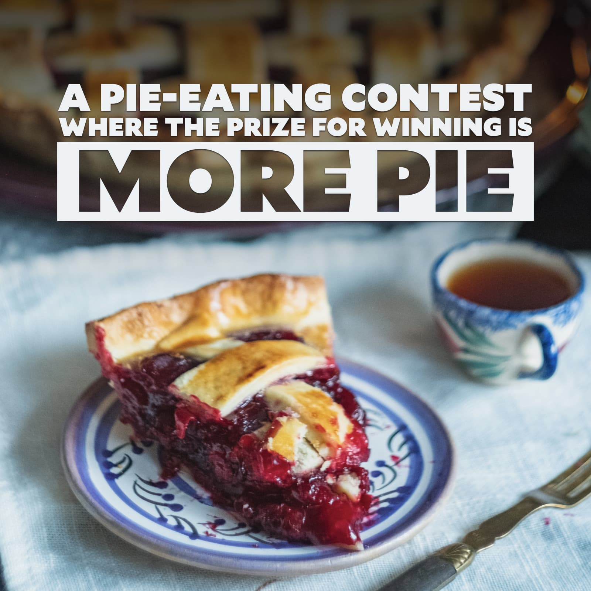

export const meta = {
  date: '2021-01-18',
  slug: 'more-pie',
  title: 'More pie',
  seo_title: 'A pie-eating contest where the prize for winning is more pie',
  description:
    'They say “no good deed goes unpunished”. When we finish projects, it often leads to additional work. Whether or not that’s a good thing is up to us.',
  category: 'impact',
  tags: ['concept'],
  image: './images/more-pie.jpg',
  useImageForSEO: true,
  cta: 'default',
};

Have you ever taken ownership of a project, and the only thanks you get for doing a good job is to have similar tasks dumped on your plate?

**You've entered a pie-eating contest where the prize for winning is more pie.**

<PostImage
  credit="Dilyara Garifullina"
  creditLink="https://unsplash.com/photos/v7pmzyGwwEc"
>

  

</PostImage>

Cynical folks love the saying "no good deed goes unpunished", and that's how it can feel if you take ownership of something just to become the dumping ground for similar work.

## How much do you like pie?

Whenever you take on ownership, you're sending a signal to the folks around you: you're willing to be responsible for this task. People who see you owning and completing this task will assume that you are both A) capable of handling this kind of work, and B) interested in doing more of it.

Whether or not that's a good thing depends on whether or not you enjoy the work.
