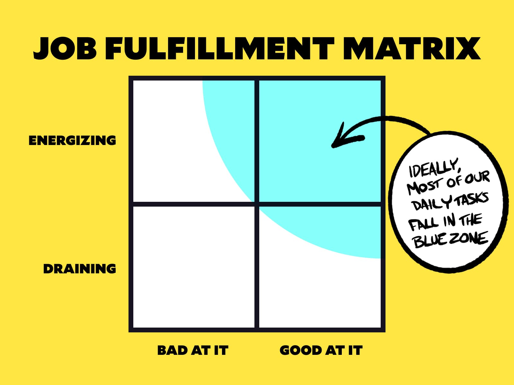

Earlier in my career, I made wild shifts between roles: I ran an agency and worked far too many hours; I was a contractor and worked as few hours as possible; I was a full-time employee that clocked out at 4:58pm sharp. No matter what my job was, though, I kept landing in this place where I felt like things were... off.

Something wasn't working, and I ended most days drained, frustrated, and generally feeling stuck.

Over the years, I started to realize that the problem wasn't the specific role, but rather the kinds of work I was doing in that role. **I wasn't happy because I didn't feel like I was doing anything meaningful — but that posed a problem: if you asked me what "meaningful work" looked like, I didn't have a good answer.**

Learning how to identify and seek out "meaningful work" has led to my career feeling significantly more rewarding and fulfilling. Let's talk about how I've done that for myself — starting with how I define "success".

## We need to know what success looks like.

Success can't just be "more". More money. More responsibility. More recognition.

The pursuit of "more" is an endless task; no matter how much of any given thing we manage to gather for ourselves, there's always a way to add more.

Instead, we need to really think about success in terms of what we *do*, not what we *have*.

When I asked people to describe success, I got dozens of answers, and each was a little bit different from everyone else's.

<blockquote class="twitter-tweet" data-dnt="true">
kind of a Shower Thoughts question, but I&#39;m curious:  what does success look like to you?  like, if you had to describe what needs to be true for you to say, &quot;I have succeeded&quot; — what goes into that description?
&mdash; Jason Lengstorf (@jlengstorf) <a href="https://twitter.com/jlengstorf/status/1369113349540093955?ref_src=twsrc%5Etfw">March 9, 2021</a></blockquote> 

These definitions are highly subjective, but success isn't an objective matter. To truly enjoy it, we need to know what success means *for ourselves*, not for other people.

This is important to start with, because part of fulfillment is tied to knowing that the work we're doing lines up with our definition of success.

## We need to know what work is fulfilling — and what isn't.

When I tackle my todo list each day, there's work that I do that leaves me feeling energized, and work that leaves me feeling drained.

In a few of my previous roles, I felt consistently drained. I would spend all my time doing things that, ultimately, didn't feel important or fulfilling. I got results, and my reviews were good, but ultimately I felt a sense of "I'm wasting my life on this".

### Just because we're good at something doesn't mean it's fulfilling.

Being good at something is only part of the formula for success. When I worked as a product engineer, I was good at breaking down product goals into tasks, breaking those tasks into tickets, and making incremental improvements to the codebase.

However, I didn't feel fulfilled by doing that work. *Parts* of the job were fulfilling, but most days I left work feeling wrung out and tired instead of excited and ready to jump back into it tomorrow.

Doing unfulfilling work is how we burn out. **[Sarah Drasner](https://twitter.com/sarah_edo) put this to me in a really concise way: "People don't burn out from too much work. The burn out from too much unfulfilling work."**

This hits home for me, because there have been points in my life where I was able to put all of my attention into something fulfilling and I never felt burned out, but at other points I was putting *maybe* 40 hours a week into draining work and I burned out fast.

### Just because we're bad at something doesn't mean it's NOT fulfilling.

In stark contrast to this, I am decidedly terrible at video effects, but I get a deep sense of fulfillment out of making something work for [my livestream](https://www.learnwithjason.dev/). It takes me far too long and I get a subpar result compared to what a professional VFX artist could do, but the struggle and my janky results give me a *huge* sense of satisfaction.

Should I do this as my full-time job? Probably not. But should I cut it out entirely because I'm not a pro in the name of "optimizing for maximum efficiency"? I don't think so.

## Write down everything you do.

Email. Meetings. Writing docs. Building features. Planning. Maintenance. Learning. Hobbies.

Write down everything.

Keep in mind that some things are different based on context. For example, I find certain kinds of meetings to be soul-sucking and pointless, but there are other meetings that I absolutely love and look forward to. When it makes sense, separate the different *types* of things into buckets based on how they make you feel.



There are a lot of places we spend time without noticing, so one thing to consider is keeping a journal for a week or so (or longer, if you're not in a hurry) to get a realistic sense of where your time goes. For bonus points, add notes about how the tasks made you feel.



## Plot the things you do on this matrix to give yourself a map to fulfillment.

After you have a list of the tasks you do, place them all on a matrix that looks like this:


  


The Y axis represents how energizing or draining a task is, with the very top being "this task is extremely energizing for me" and the bottom being "this task completely drains me".

The X axis represents our competence at a given task. This can be based on how competent you feel, how your feedback from others looks, or a combination of the two. At the far right is something that you're really good at, and at the left is something that you struggle to get right.

The blue zone shown at the top-right of this matrix is where fulfillment lies. In an ideal role, most — if not all — of the tasks we do will fall into this blue zone.

It's important to note that the blue zone isn't *only* tasks that we're both good at and find energizing. While the vast majority of what we do will hopefully meet both criteria, I think it's important to allow for a little bit of work that doesn't fall directly into that quadrant.

### Doing a few things that we're bad at, but find energizing, gives us room to grow.

In my own career, I generally seek out work that is 10% beyond what I know how to do. This means that I'll make mistakes and won't always be the best at getting things done, but that 10% is where growth happens.

If we're already really good at everything we do, we risk stagnation, which can hollow out a sense of fulfillment in our work.

### Work isn't always fun. Using our skills to take care of the dull work moves the team forward.

In general, different people will find different kinds of work rewarding. For someone who's a great product manager, going through mountains of data and turning that into Gantt charts, roadmaps, and todo lists can be extremely engaging and fulfilling. For me, it's a brutal slog.

When we can, it's great to match people up that enjoy different things so the team is able to do what's fulfilling and cover each other on tasks that others would find draining.

However, that's not always possible. Some work needs to get done and there's no one around who finds it fulfilling. In that case, taking on *some* work that you're really good at even though it's draining helps move the team (and, by proxy, your career) forward toward success. The trick here is balance — too much of this kind of work is a fast track toward burnout.

## What’s in your blue zone?

Knowing what you find fulfilling doesn't change what you're doing today, but it gives you a better idea of what to start moving toward. Maybe it starts with a conversation with your manager, or with delegating tasks, or with taking a hard look at whether you should continue with a given role. (I've done all three in my career as a result of doing this exercise.)

**This exercise doesn't create fulfillment, but it helps you draw a map to it.** I've found this to be incredibly helpful whenever I start to feel run down at work, and usually I realize that I've started to let most of my tasks slip into the "good at it but draining" quadrant.

So what's in your blue zone? What actions can you take to help you move more of your day-to-day tasks into the blue zone? [I'd love to talk about it on Twitter!](https://twitter.com/compose/tweet?text=How%20to%20draw%20a%20map%20to%20a%20fulfilling%20career%20by%20@jlengstorf&url=https://www.jason.af/career-fulfillment-matrix/)
