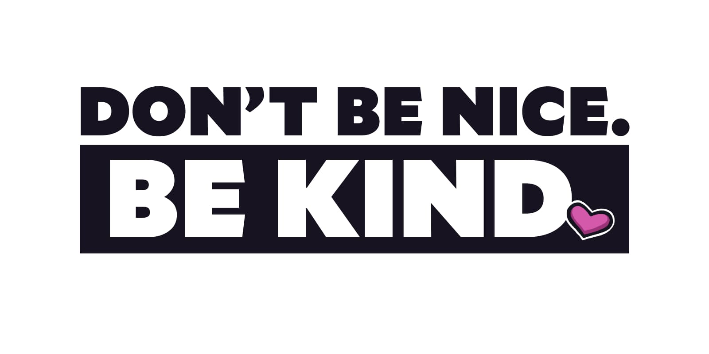

Among my least favorite phrases that are commonly accepted as wisdom is "if you don't have anything nice to say, don't say anything at all."

**The be-nice-or-be-quiet mentality is one of the most destructive forces I've ever seen in both personal and professional settings.** I've watched multiple friendships, relationships, and companies implode because everyone was so focused on being nice that they forgot to be kind.

To me, "be nice" is too often coded language for "don't make anyone uncomfortable" — but to be kind, we often need to have uncomfortable conversations.

So let's stop being *nice* and instead work to be *kind*.





## To "be nice" is to avoid conflict and discomfort

In a few of my previous roles, I've asked for feedback and been told that everything was going great. Later, I'd find out through the rumor mill that there were things I did that were causing problems.

At the time, I was equal parts confused and furious. I'd asked for feedback! Why wouldn't they give me that feedback when I specifically asked for it?

Later, I realized what had happened: **I didn't get feedback because people were "being nice". They wanted to avoid conflict and uncomfortable conversations with me, so they just... didn't say anything.**



**Please note:** I know that there's privilege required when deciding not to be nice, and that there are situations where causing discomfort is a direct safety risk. I want to be clear that I'm not advocating for _never_ being nice, even if it poses a threat to someone's health or safety.



## Long term, being nice causes much more conflict and discomfort

The insidious reality of being nice, though, is that it doesn't _avoid_ conflict or discomfort — it just delays it. And the thing about hard conversations is that they only get harder as more time lapses between when the problem starts and when it's discussed.

I once broke up with a long-term girlfriend over a fast food order. As we were trying to finalize the order, I did something that annoyed her, but she wouldn't tell me what I'd done. This was something she did that annoyed the hell out of me — and that _had been_ annoying me for our entire relationship — but I'd never told her.

For months we'd been nice to each other, not bringing up the small tensions in our relationship. Until, all at once, we unloaded all of those minor discomforts in a screaming match about Subway sandwich toppings that ultimately ended our relationship.

**Being nice doesn't prevent problems; it puts them into a savings account and lets them collect interest.**

## Being nice is a betrayal of trust

There's a vanishingly thin line between being nice and outright lying.

If I've managed to smear mustard on my face during a meal and you see it but say nothing — you know, to "be nice" and not embarrass me — I don't feel like you were nice. In fact, when I get home and realize I've had mustard on my face for the last two hours while I ran errands, I feel like you betrayed me. How could you — my friend — let me walk off without giving me a heads up?

The feeling of betrayal is so much worse when someone is "nice" about behavior that does harm through ignorance. Did I phrase something poorly and belittle someone's work? Did I fail to give proper credit for an idea? Did I make someone feel small or disrespected through my tone or attitude?

Being "nice" and not bringing that behavior up means there's little hope that I can address that behavior and grow. If I find out months later during a review that I did this and no one gave me feedback, I'll feel terrible not only because I caused harm through my ignorance, but _also_ because I've failed to prove myself as someone who's worth giving that feedback to.

**"Being nice" to avoid conflicts can lead to closed off, protective behavior that undermines trust and safety on a team.** We start to think, "I have no idea what people really think of me, so I should be very guarded and political to avoid getting a negative review again."

Distrust, doubt, and discord — all because we wanted to be nice.

## Being kind means being temporarily uncomfortable

**To sit someone down and say, "I care about you, and because I care about you I want to tell you something that might not be comfortable to hear," is kindness.** Yes, it's uncomfortable. Yes, it might be awkward and there might be a day of feeling weird about things.

**Ultimately, choosing kindness over niceness is what builds trust and fosters growth.**

## Being kind means giving feedback quickly and honestly

**The shorter the gap between the problem and the feedback, the less likely things are to fester or spiral out of control.** If I make a mistake today and you approach me about it immediately, we're going to talk about the mistake.

If I make a mistake today and you approach me about it in six months, we're going to talk about the mistake _and why you didn't bring it up sooner._

**The best managers I've had (hi [Sarah](https://twitter.com/sarah_edo) and [Robin](https://twitter.com/shinytoyrobots)) give immediate feedback and don't give problems enough room to expand.** They address the problems directly and immediately, giving tough feedback from a place of caring.

These immediate feedback loops gave me confidence in the team. There was no secret reality that was covered up by niceness; things really were the way they seemed because issues were dealt with openly and honestly.

## Being kind means valuing growth and trust

For me, kindness is making an earnest effort to provide the people around me with the information, trust, and support they need in order to grow. There are many facets of kindness, but they all share a common core: **kindness is choosing to value someone else's growth over your own comfort.**

Creating relationships and teams that value kindness over being nice lays a foundation for deep trust and high growth. 



**Heads up!** It's important to note that kindness is *not* radical honesty. The goal isn't to say everything we think, regardless of whether it's uncomfortable or cruel. Instead, our goal should be to provide honest feedback to the people around us in an effort to provide them with the information they need to grow and improve.



## Please stop being nice

On the surface, being nice seems like a way to avoid conflicts and keep everyone from feeling uncomfortable. In reality, being nice only hides the problems away, where they fester and become much bigger, harder to resolve problems.

Instead of being nice, strive to be kind. Think long-term about the health of relationships and teams, and provide immediate, honest feedback to create an environment of trust and growth. Choose kindness over comfort, honesty over appearances, and action over ignoring things and hoping they'll go away.

## How can you practice kindness today?

Are there any places in your life where you're being nice instead of kind?
