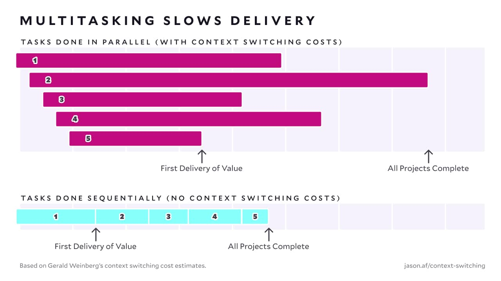

You know how sometimes you hear an idea that is so obviously and demonstrably incorrect that you can't really understand how it became popular? For me, multitasking is that idea. **The lie that we can get more work done by working on multiple things at once is so absurd, so incorrect, and so utterly destructive that I can't believe it's a near-universal practice.**

And yet, we all get suckered into believing it. I mean, _I absolutely know_ that it's a terrible idea, and I _still_ end up multitasking.

But I understand how it happens — it's a seductive idea: "I have three things I need to finish. I'll spend a little time working on each one, and then all three will be done faster!"

But in reality, **multitasking is a productivity disaster.** It not only fails to get projects done faster — it makes them _significantly_ slower to complete.

## Multitasking is how we manage to work hard all day and still get nothing done.

We've all had days where we _know_ we were working but we can't for the life of us figure out what we actually got _done_.

For me, those days are _always_ because I spent the entire day bouncing between tasks instead of focusing on a single thing.

Rather than actually _working_, I spent the entire day _context switching_.

Multitasking in action is a disaster.


  It's 9am. You've got your coffee, you've got a pocket full of dreams, and you've got a big-ass todo list.

  You've decided that you'll get that list done faster by multitasking.

  You start with email. This one looks important; better reply. You get a few sentences into the reply, then switch over to Slack.

  Lots of messages in Slack. Oh, here's an urgent one. Better respond to that. It needs some detail from email, though, so you head back over there.

  Ah, shit, never finished that first reply. Better do that first.

  Wait, this reply is asking about a project that's not quite done. But you can finish it up in a few minutes!

  Fire up the code editor. Make a few changes and open a pull request. While you're here, might as well check GitHub notifications.

  A few PRs requested your review. You're already here, right? Might as well get that done.

  Knock one of them out and start a second, but you have a question. Open Slack again. Dammit! Never sent that urgent reply! Oh, right, because it needed something from email.

  Back to email!

  Crap crap crap, back to GitHub to grab that PR link so you can actually respond to that first email. Someone left a comment, though — better address that feedback before you forget!

  Back to the code editor. Wait! You really need to send that email so you can respond to Slack so you can ask that question so you can finish your code review!

  Hey, how is it lunchtime already?


## Context switching is the silent killer of progress.

Gerald Weinberg’s book [_Quality Software Management: Systems Thinking_](https://www.powells.com/book/quality-software-management-volume-1-systems-9780932633224) offers up a heuristic for the impact of context switching: for every additional parallel task, 20% of working time is lost to context switching.

If we plot that time loss on a bar chart, it's pretty chilling.


  


That means for every parallel task you work on, you're losing about one full working day each week.


  We talk about wanting [four-day workweeks](https://www.cnbc.com/2022/06/20/four-day-week-these-firms-say-theyve-nailed-the-new-working-model.html), but... not like this.


And it's worse than you might think: **context switching time loss is _compounding_ — five parallel tasks means you can expect about 80% time loss to context switching.**

If that sounds hyperbolic, think back to a day where you worked hard on a few projects all day and yet nothing was crossed off your todo list. That's context switching time loss chompin' on your time; 5⨉ the time spent to get the same tasks done.

## Multitasking feels productive, but sequential work \*is\* productive.

When you're staring down a sizable backlog with lots of stakeholders who feel very strongly that their project needs to be done _right fucking now_, the temptation is to start everything at once and work on things in parallel to "keep everything moving".

Lots of in-flight projects feels productive. It feels _good_. Look how busy we are! We're killing it! Go us!





The unfortunate reality, however, is that we're moving _significantly_ slower than we would if we just did these projects sequentially. **Working on one project at a time leads to both faster initial delivery and faster completion of all projects.**

## How to become as productive as you thought you were before you realized how much time you were wasting with context switching.

Something that still perplexes me about multitasking is that **knowing how awful multitasking is doesn't actually prevent people from doing it.** I've been up on a soapbox [arguing against multitasking for years](https://www.recallact.com/presentation/how-i-cut-my-working-hours-half-and-somehow-managed-get-more-done), and I _still_ find myself losing days to context switching.

It requires deliberate effort and good habits to combat the siren song of multitasking. Here are a few of the techniques I use to keep myself productive and focused on a single task.

### 1. There can only be one priority.

The idea of having multiple priorities was invented by management consultants. It's the original corporate nothing word — it's a thing you say to make people feel good without actually accomplishing anything.

<blockquote class="twitter-tweet" data-dnt="true" data-theme="light">
The word priority came into the English language in the 1400s. It was singular. It meant the very first or prior thing. It stayed singular for the next five hundred years. Only in the 1900s did we pluralize the term and start talking about priorities.
&mdash; Greg McKeown (@GregoryMcKeown) <a href="https://twitter.com/GregoryMcKeown/status/1068597534157869056?ref_src=twsrc%5Etfw">November 30, 2018</a></blockquote> 

**Pretending we can have more than one thing at the top of the list just means we're not actually prioritizing anything.**

When you prioritize, choose the _one thing_ that needs to be done first, and _only work on that one thing_.

### 2. Close everything and use timers.

One of the sneakiest forms of multitasking is distraction. Bouncing between apps breaks concentration — that's a context switch.

Combat this by choosing an interval that works for you, set a timer, and close everything unrelated to your task for that full working block.


  Personally, I like 90 minutes. It's long enough for me to get really stuck into a project and make meaningful progress, but not so long that I'm unreachable at work or leaving any big decisions hanging.


There are lots of strategies and apps to help with this, but don't overthink it. Just close stuff and set a timer.


  **Heads up!** If you want to hear me yelling at you if you get distracted, I [partnered up with Centered](https://www.centered.app/dashboard/group/flow-with-jason-1) to create a group specifically for doing this kind of focused work.


### 3. Break down large tasks into smaller milestones.

With large projects, it can feel unrealistic to _only_ work on one thing for months. But that doesn't mean you should just give up and multitask.

Instead, **break large projects into milestones and treat each milestone as a project that you can focus on exclusively.** This allows you to make progress in a productive way, get to a logical stopping point, and then work on the next project — whether that's the next milestone or something unrelated.

The trick is to find natural breakpoints in projects. For example, if I was building a new website, I might set milestones like "define the information architecture of the site", "create lo-fi wireframes", "design the home page", "convert the design to HTML and CSS", and "add interactivity with JavaScript".

Each of these milestones is reasonably self-contained and allows me to hit a logical stopping point, work on something else, and then come back without needing to rebuild all the context from the previous phase — I'm starting something related, but contextually different.

## Seriously. Please stop multitasking.

Multitasking has no redeeming qualities. It's the high fructose corn syrup of work habits; it's bad for us, makes us feel worse, and only exists because someone thought it would help them make more money.

It's not solely responsible, but **multitasking and context switching time loss are heavy contributors to feeling overwhelmed, frazzled, and burned out at work.**

And again — I truly cannot stress this enough — it has _zero_ benefit. Multitasking is choosing pain and making a wish that we know will never come true.

Just do one thing at a time. It's better. Faster. Less stressful. More effective.

Literally everything about it is better.

Stop multitasking.

Please.
