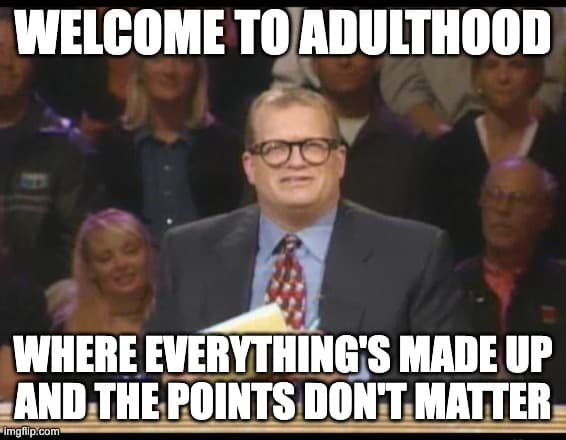

This may be my most controversial belief. On its face, it might sound bleak, but stick with me — I promise that this is actually the source of my positive outlook. So keep that in mind, and read until the end before you send me your rebuttal.


  But please do talk to me about this. One of my favorite things to do is debate the meaning of life with friends over a beverage.


## Prefer to watch instead?

This article is based on a question I was asked on [my livestream](https://www.learnwithjason.dev). You can watch my thoughts on this instead of (in addition to?) reading them if you prefer.


  <iframe width="560" height="315" src="https://www.youtube-nocookie.com/embed/DOHZi6Em6H8" title="YouTube video player" frameborder="0" allow="accelerometer; autoplay; clipboard-write; encrypted-media; gyroscope; picture-in-picture; web-share" allowfullscreen></iframe>


## What’s left if the power goes out?

As a web developer, I get paid a higher-than-average amount to move dots on a screen in exchange for someone transferring some numbers from their electronic account into mine. **If the power goes out, nearly everything I interact with and think about all day goes away.**


  
 

## Extrinsic meaning is a myth

If we start peeling back the layers — computers, capitalism, human society — you don’t have to ask “why?” too many times before you end up at “because culture is a shared delusion where we all agree to pretend that there’s some sense to all this stuff”.

All of this is built on a foundation of “because I said so”. Even a seemingly simple question like “what does it mean to be good?” boils down to the word of whichever god or philosopher you believe in.

**Nothing external can prove to me that the work I do is important, or that the work matters, or that I matter, or that I am good, or that I am useful.**

We can look for our purpose outside of ourselves, but ultimately we’ll only find other people’s opinions.

## There’s no scorecard

If there’s no external meaning, that also means there’s no “right” way to live. Everyone will have opinions, but no one has an answer — and the only answer that actually matters is the one you find inside your own heart.

**You have to figure out why you exist. No one else can do it for you.** Not your parents, not your friends, and certainly not your employer.


  


My job may not have any objective meaning, but it does provide mean with the means and opportunity to do things that I find personally meaningful and rewarding.

I get to connect with other people and help them do more of what they’re interested in. I get to play and explore and learn with friends (which, for me, is what’s most meaningful in life). I get to challenge myself to grow and think in different ways.

## The ending is always the same

We all live the same life when you zoom out: we’re born, we live for a while, and then we die.

The details of how we choose to spend that middle part make up the meaning and purpose of our lives.

**When we’re on our deathbeds (if we’re lucky enough to have time to reflect on our lives at the end), what’s most important? What will make you think to yourself, “I lived a good life. This wasn’t wasted time.”?**

That’s a scary question to contemplate. And it’s not question that can be answered by anyone else. It has to come from within.

Because if you don’t believe that you’re living in service of something meaningful — if you don’t feel it in your bones — then no amount of someone else telling you it’s meaningful will magically make you believe it later.

## The “what” doesn’t matter as much as the “how” and the “why”

People see the outcome of our choices and behavior. Are you someone who makes the people around them happier and better and stronger? Are you someone who seems happy?

I want to be around the builders. The makers. The people who are curious and engaged and smiling and enjoying their lives. _What_ they’re doing doesn’t matter — what I care about is that **they’re clearly lighting up when they talk about things they find meaningful, and they’re excited to share and fully engaged.**

## Meaning is what you make it

**Meaning comes from finding things that feel deeply satisfying and making deliberate choices to do more of those things and share them with people you care about.** For me, that includes creating a great website or video, cooking a great meal for my friends, or helping someone find the “light bulb moment” as they’re learning something new.

So, sure: none of this stuff really matters. But that’s great news, because it means you can do _whatever you find meaningful_ — and as long as it’s making you and the people around you happy, you’re living a wonderful, meaningful life.

## Get more like this directly in your inbox

I’m a web generalist who believes that a great path to a fulfilling career is through exploration, play, and examining how we interact with the world around us. I publish across multiple sites and media regularly, so subscribing to my newsletter is the best way to make sure you don’t miss anything!


